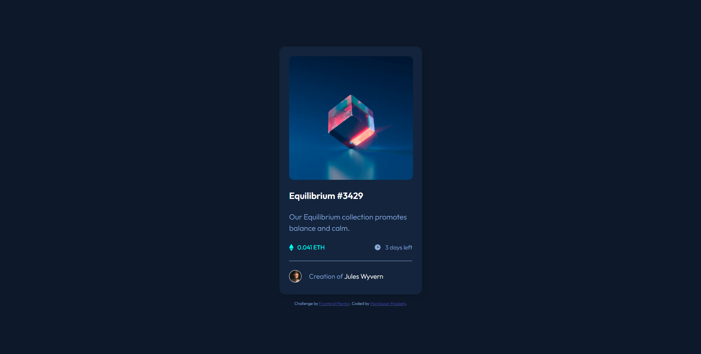
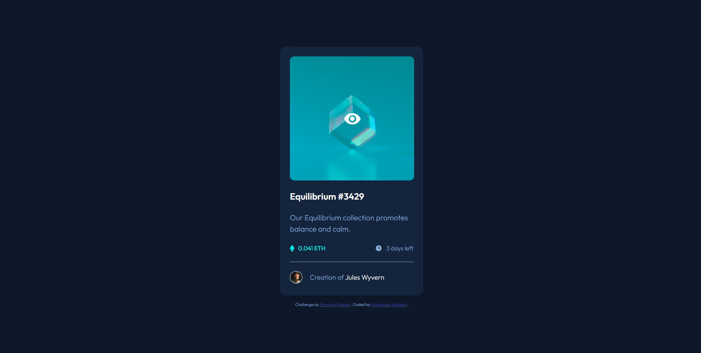

# Frontend Mentor - NFT preview card component solution

This is a solution to the [NFT preview card component challenge on Frontend Mentor](https://www.frontendmentor.io/challenges/nft-preview-card-component-SbdUL_w0U).

## Table of contents

- [Overview](#overview)
  - [The challenge](#the-challenge)
  - [Screenshot](#screenshot)
  - [Links](#links)
- [My process](#my-process)
  - [Built with](#built-with)
  - [What I learned](#what-i-learned)
- [Author](#author)

## Overview

### The challenge

Users should be able to:

- View the optimal layout depending on their device's screen size
- See hover states for interactive elements

### Screenshot

### Links

- Solution URL: [Solution](https://your-solution-url.com)
- Live Site URL: [live site](https://your-live-site-url.com)

## My process

### Built with

- Semantic HTML5 markup
- CSS custom properties
- Flexbox
- CSS Grid

### What I learned

I learned so much on this project even it's a small one but it took me longer than I thought it would. Mainly I learned how to rely on myself and how to do some research and look for insight.

Unfortunetly I didn't use git I just uploaded the project to the github repository directly but I intend to learn GIT commands in future challanges and projects

## Author

- Frontend Mentor - [@m00nta](https://www.frontendmentor.io/profile/m00nta)
- Twitter - [@m00nta](https://twitter.com/m00nta)
